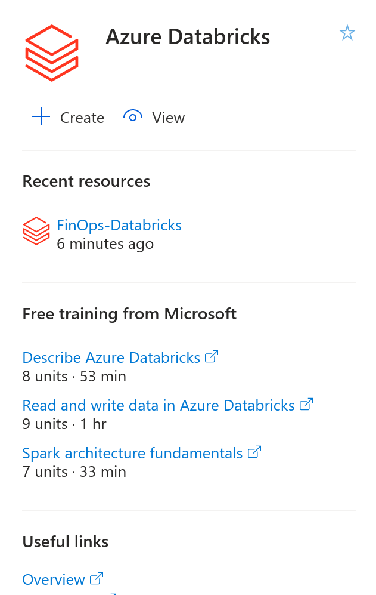
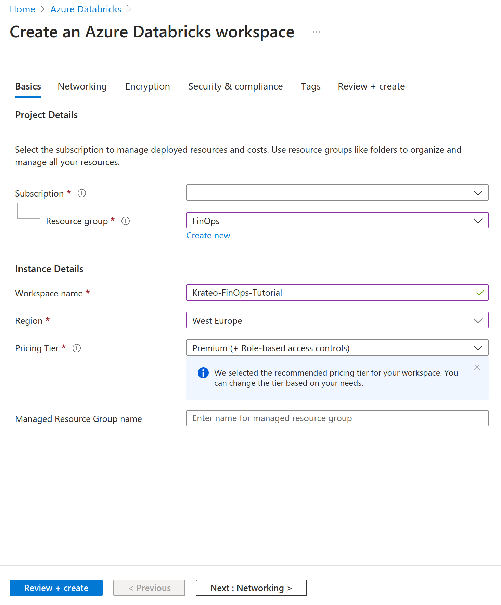
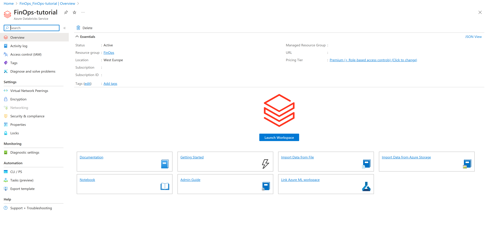
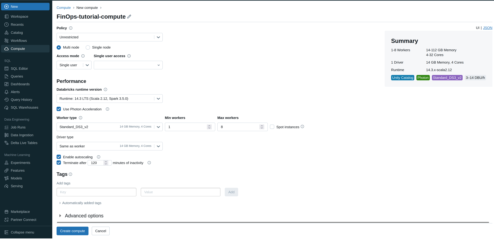
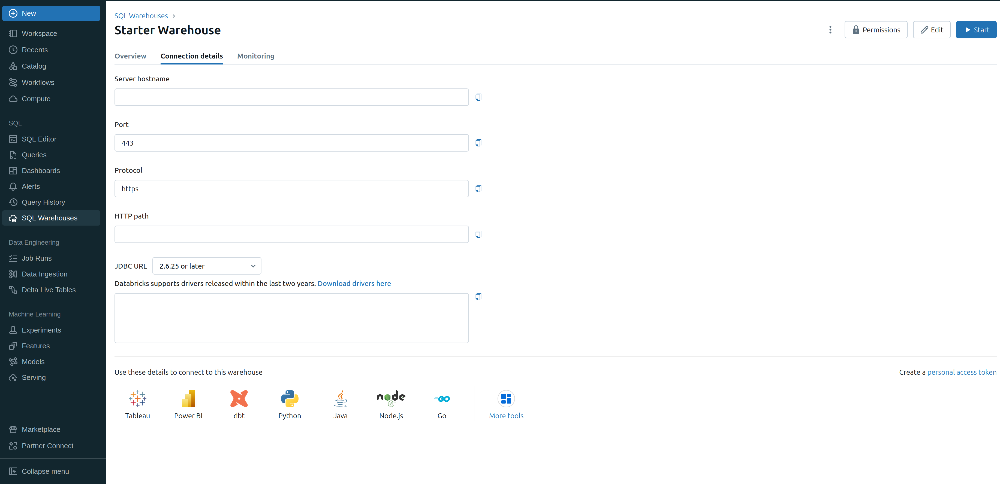

## Let's configure Azure Databricks for data storage
In this step, we will configure a new Databricks resource on Azure to allow the scrapers to upload the exported data to a database. If you already have a Databricks cluster, skip to the next step.

Create a new Databricks resource on Azure.

Assign a subscription, resource group and name, then click on review and create to proceed. Create the deployment.

Hit launch workspace.

In Databricks, in the top left, select new -> compute -> cluster.

In the compute resource creation form, select the type of machine type you would like to use, the number of instances (min-max) and the name, then create it. This is necessary to run the Python notebook. Keep the name of the cluster at hand.

In the left menu, select "SQL warehouse", then click on "Starter warehouse". Switch to the second tab, connection details. Copy the hostname. Then, in the bottom right, create a new personal access token. Generate a new token and save the token. Keep the token at hand.

You now have a Databricks cluster ready.
