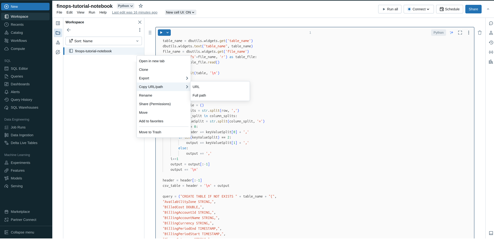

## Let's configure the Azure Databricks notebook

In Databricks, in the top left, select new -> notebook. The notebook will use by default Python. If not, select it in the top right.
Copy the following code in the notebook: 

```
table_name = dbutils.widgets.get('table_name')
dbutils.widgets.text("table_name", table_name)
file_name = dbutils.widgets.get('file_name')
with open('/dbfs'+file_name, 'r') as table_file:
    table = table_file.read()

rows = str.split(table, '\n')

i = 0
header = ''
output = ''
for row in rows:
    values_tuple = ()
    column_splits = str.split(row, ',')
    for column_split in column_splits:
        keyValueSplit = str.split(column_split, '=')
        if i == 0:
            header += keyValueSplit[0] + ','
        if len(keyValueSplit) == 2:
            output += keyValueSplit[1] + ','
        else:
            output += ','
    i+=1
    output = output[:-1]
    output += '\n'

header = header[:-1]
csv_table = header + '\n' + output

query = ("CREATE TABLE IF NOT EXISTS " + table_name + "(",
"AvailabilityZone STRING,",
"BilledCost DOUBLE,",
"BillingAccountId STRING,",
"BillingAccountName STRING,",
"BillingCurrency STRING,",
"BillingPeriodEnd TIMESTAMP,",
"BillingPeriodStart TIMESTAMP,",
"ChargeCategory STRING,",
"ChargeDescription STRING,",
"ChargeFrequency STRING,",
"ChargePeriodEnd TIMESTAMP,",
"ChargePeriodStart TIMESTAMP,",
"ChargeSubcategory STRING,",
"CommitmentDiscountCategory STRING,",
"CommitmentDiscountId STRING,",
"CommitmentDiscountName STRING,",
"CommitmentDiscountType STRING,",
"EffectiveCost DOUBLE,",
"InvoiceIssuer STRING,",
"ListCost DOUBLE,",
"ListUnitPrice DOUBLE,",
"PricingCategory STRING,",
"PricingQuantity DOUBLE,",
"PricingUnit STRING,",
"Provider STRING,",
"Publisher STRING,",
"Region STRING,",
"ResourceId STRING,",
"ResourceName STRING,",
"ResourceType STRING,",
"ServiceCategory STRING,",
"ServiceName STRING,",
"SkuId STRING,",
"SkuPriceId STRING,",
"SubAccountId STRING,",
"SubAccountName STRING,",
"Tags STRING,",
"UsageQuantity DOUBLE,",
"UsageUnit STRING, ",
"Value DOUBLE",
");")
query = ''.join(query)
print(query)
if len(column_splits) == 40:
    spark.sql(query)
else:
    spark.sql("CREATE TABLE IF NOT EXISTS " + table_name + ";")

from pyspark.sql.functions import lit, col
import pandas as pd
from io import StringIO

df = spark.table(table_name)

csv_data = StringIO(csv_table)
pandas_df = pd.read_csv(csv_data)
pandas_df.columns = pandas_df.columns.str.strip()
for col_name in pandas_df.columns:
    if pandas_df[col_name].dtype == 'object':
        try:
            pandas_df[col_name] = pd.to_datetime(pandas_df[col_name])
        except ValueError:
            pass

newRow = spark.createDataFrame(pandas_df)

if len(df.columns) > 0:
    append = newRow.exceptAll(df)
    append.write.saveAsTable(name = table_name, mode = 'append', mergeSchema = True)

else:
    newRow.write.saveAsTable(name = table_name, mode = 'overwrite', overwriteSchema = True)
```

Give the notebook a name. Then, click on the folder in the left bar. A workspace menu should open. Search for your notebook and click on the three dots. Select "Copy URL/Path" -> "Full path". Keep the full path on hand.



Let's create the Databricks database configuration custom resource:
```
apiVersion: finops.krateo.io/v1
kind: DatabaseConfig
metadata:
  name: # config name
  namespace: default
spec:
  host: # host name for the database
  token: # access token
  clusterName: # generic compute cluster name
  notebookPath: # path to the notebook 
```

Input your data in the following configuration file and save it. ("CTRL+X", then "Y", then "enter")

```plain
echo "apiVersion: finops.krateo.io/v1
kind: DatabaseConfig
metadata:
  name: finops-tutorial-config
  namespace: default
spec:
  host: # host name for the database
  token: # access token
  clusterName: # generic compute cluster name
  notebookPath: # path to the notebook" > database.yaml
nano database.yaml
```{{exec}}

Now, apply the configuration of the database to the cluster.

```plain
kubectl apply -f database.yaml
```{{exec}}
